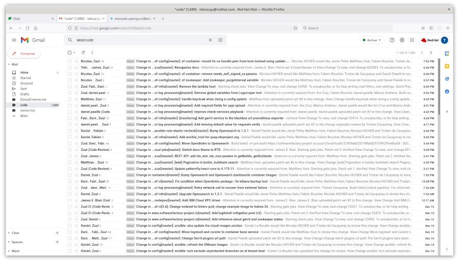
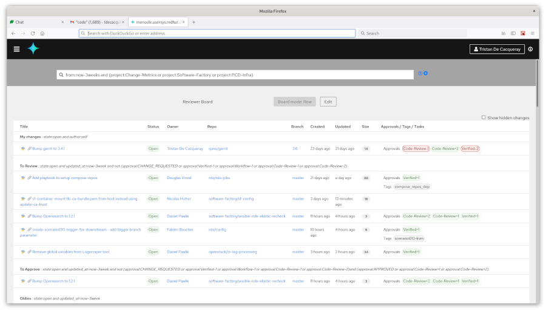

In this post I present how Monocle has improved my developer workflow.

I am working with multiple review systems (4 Gerrits, 2 GitLab, Pagure and GitHub), and
managing my time to do effective code reviews is complicated.

Mail inbox
==========

My inbox looks like this:

As you can see, it is quite overwhelming. In particular:

- The thread list does not show the change's metadata. For example, I would like to know if a given change has positive feedback.
- The list contains irrelevant changes such as WIP items that are not yet ready for review.

I have found that using the mail inbox to manage review is impractical. Let's see how Monocle has helped improve my workflow:

Monocle board
=============

My review board looks like this:

As you can see, it is much more tidy. Using the search query language, I can easily narrow down the list of changes that need my attention.

My workflow
===========

I use the board once or twice a day, usually after breakfast and lunch. My goal is to empty the `To review` category:

- I use the `hide change` feature to discard things that don't look important. (Monocle will un-hides on update)
- Then, I review the few remaining changes.
- Monocle will unhide changes if they are updated.

This is a net improvement, Monocle lets me do more effective reviews in less time.
